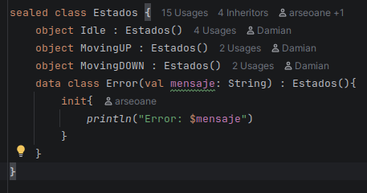
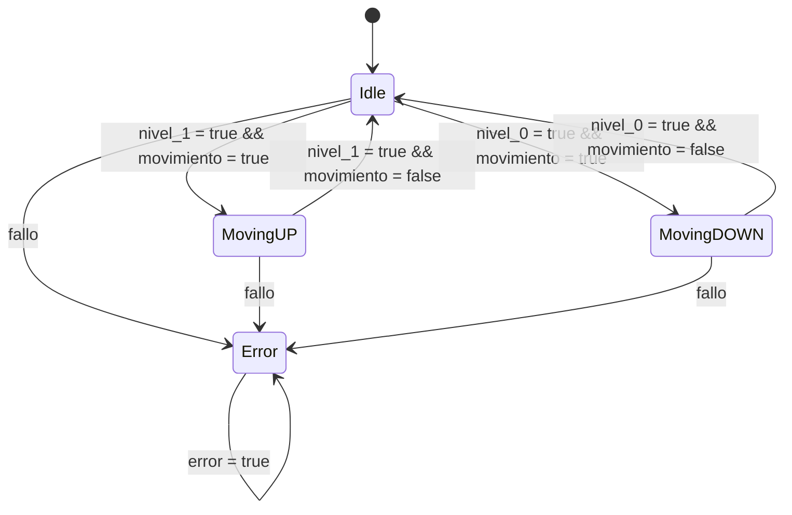

### Añadidos booleans *nivel_0*, *nivel_1* y *error*

### Implementado mensaje de error en *Error*

### Diagrama:

```mermaid
stateDiagram-v2
    [*] --> Idle

    Idle --> MovingUP: nivel_1 = true && movimiento = true
    MovingUP --> Idle: nivel_1 = true && movimiento = false

    Idle --> MovingDOWN: nivel_0 = true && movimiento = true
    MovingDOWN --> Idle: nivel_0 = true && movimiento = false

    Idle --> Error: fallo
    MovingUP --> Error: fallo
    MovingDOWN --> Error: fallo
    Error --> Error: error = true


```